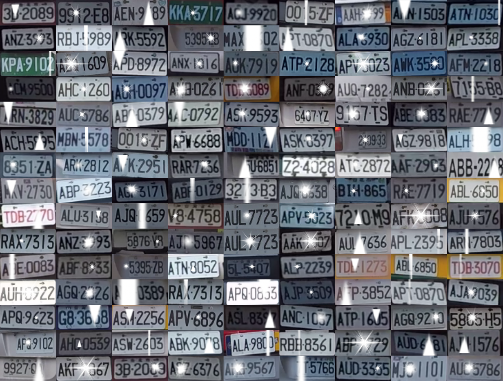
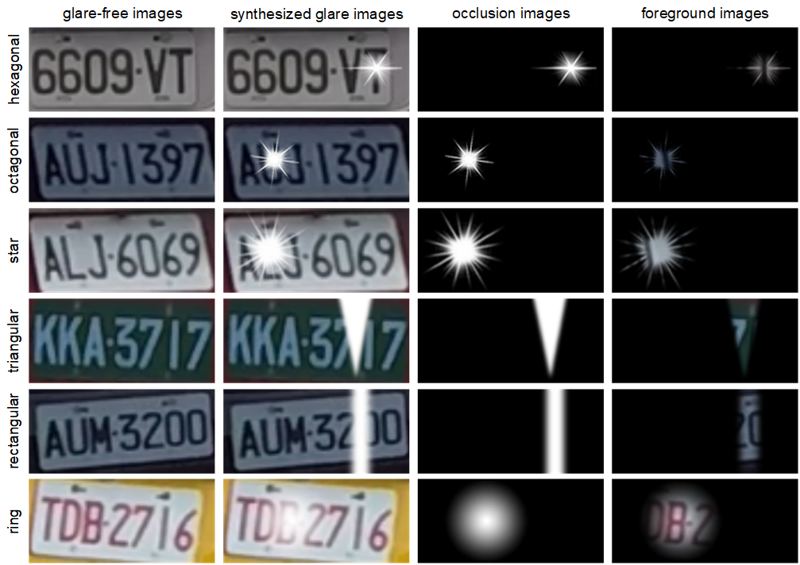

# News
* **2021-02-23** Amount of images of **Sun glare image dataset** are all increased to 87.5k now.
* **2020-02-23** If Google Drive is not accessible, please download the dataset using Baidu Drive.

## Overview
**Sun glare image dataset**, a new dataset for synthesized sun glare, features three appealing properties: good quality, large scale, and high diversity. A total of **1,166** glare-free license plate images with different plate numbers were collected at road during morning commute traffic. The glare-free images in our dataset were divided into two subsets, namely the training and testing subsets. We randomly sampled **1,000** glare-free images to be the training set, and the remaining **166** glare-free images comprised the testing set. There are **75** base masks which could be classified into **6** subset to simulate the catoptric behaviors of sunlight. The number of synthesized glare images in each subset is presented in **Details** part.

## Details
We contribute **Sun glare image dataset**, a large-scale sun glare image dataset, which has several appealing properties:
- All images in **Sun glare image dataset** are normalized into a size of **80 * 176** pixels.

- **Sun glare image dataset** consists of **87.5k** synthesized glare images, glare-free images, occlusion images, and foreground images.

- To simulate the catoptric behaviors of sunlight to synthesize glare images, each base masks could be classified into **6** subset. See the table below.

| Subset          | Hexagonal | Octagonal | Star | Triangular | Rectangular | Ring |
|:----------------|----------:|----------:|------------:|-----------:|-----------:|-----------:|
| #base masks     |       12  | 15  |12|13|16|7|
| #training images |    12000  | 15000|12000|13000|16000|7000|
| #testing images  |     1922  | 2490|1992|2158|2656|1162|

## Space Requirement
* Training Set: ~2.4 GB
* Testing Set: ~500 MB
* Total: ~3 GB

## Data Structure
After unzipping the files, you will get all the data in the following folder structure:
```
dataset
|--train
   |--foreground_images
      <several foreground images>
   |--glare-free_images
      <several glare-free images>
   |--occlusion_images
      <several occlusion images>
   |--synthesized_glare_images
      <several synthesized glare images>
|--test
   |--foreground_images
      <several foreground images>
   |--glare-free_images
      <several glare-free images>
   |--occlusion_images
      <several occlusion images>
   |--synthesized_glare_images
      <several synthesized glare images>
```

## Sample Images


## Agreement
Before downloading and using the sun glare image dataset, please agree to the following terms of use. You, your employer and your affiliations are referred to as “User”. The authors and their affiliations, Yuan Ze University, are referred to as “Producer”.
* The **Sun glare image dataset** is available for non-commercial research purposes only.
* You agree not to reproduce, duplicate, copy, sell, trade, resell or exploit for any commercial purposes, any portion of the images and any portion of derived data.
* You agree not to further copy, publish or distribute any portion of the **Sun glare image dataset**. Except, for internal use at a single site within the same organization it is allowed to make copies of the dataset.
* The BigMMS Laboratory reserves the right to terminate your access to the **Sun glare image dataset** at any time.
* For using sun glare image dataset, please cite the following papers:
```
@ARTICLE{ChenTITS2021,
  author={B. -H. {Chen} and S. {Ye} and J. -L. {Yin} and H. -Y. {Cheng} and D. {Chen}},
  journal={IEEE Transactions on Intelligent Transportation Systems}, 
  title={Deep Trident Decomposition Network for Single License Plate Image Glare Removal}, 
  year={2021},
  volume={},
  number={},
  pages={1-12},
  doi={10.1109/TITS.2021.3058530}}
```
```
@INPROCEEDINGS{YeICIP20,
author={S. {Ye} and J. -L. {Yin} and B. -H. {Chen} and D. {Chen} and Y. {Wu}},
booktitle={IEEE International Conference on Image Processing (ICIP)},
title={Single Image Glare Removal Using Deep Convolutional Networks},
year={2020},
volume={},
number={},
pages={201-205},
doi={10.1109/ICIP40778.2020.9190712}}
```


## Download
* Paper [[PDF]](https://ieeexplore.ieee.org/document/9357944)
* Sun glare image dataset [[Google Drive]](https://drive.google.com/drive/folders/1He7MLn-7Kcvdj6rJPpF50xR0e21vqQ0R?usp=sharing) [[Baidu Drive]](https://pan.baidu.com/s/1I4I2ge8uJfSciB-VeB2imw) (password: bkf1)


## Contact
Please contact [Hsiang-Yin Cheng](mailto:qwaszx841002@gmail.com), [Jia-Li Yin](mailto:jlyin@fzu.edu.cn), or [Bo-Hao Chen](mailto:bhchen@saturn.yzu.edu.tw) for questions about the dataset.
